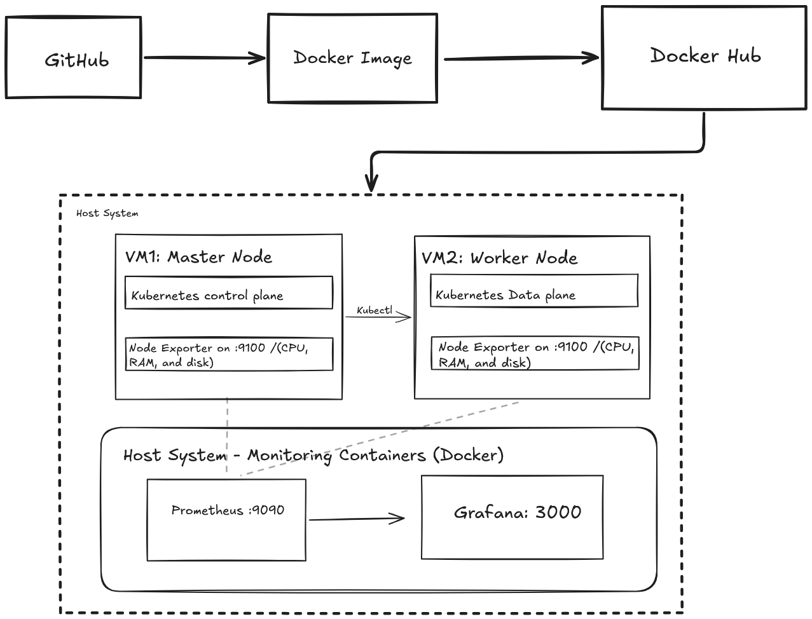

# Kubernetes Deployment Strategies with Monitoring

> Demonstrating Kubernetes rolling updates, rollbacks, and real-time monitoring using Prometheus & Grafana on a 2-node cluster.

---

## 📋 Table of Contents

- [Objective](#objective)
- [Project Overview](#project-overview)
- [Architecture](#architecture)
- [Tools \& Technologies](#tools--technologies)
- [Infrastructure Setup](#infrastructure-setup)
- [Implementation Steps](#implementation-steps)
  - [1. Kubernetes Cluster Setup](#1-kubernetes-cluster-setup)
  - [2. Application Containerization](#2-application-containerization-using-docker)
  - [3. Deployment, Rolling Update \& Rollback](#3-kubernetes-deployment-rolling-update-and-rollback)
  - [4. Monitoring with Prometheus \& Grafana](#4-monitoring-setup-using-prometheus-and-grafana)
- [Project Structure](#project-structure)

---

## Objective

To demonstrate Kubernetes deployment strategies including **rolling updates** and **rollback**, along with real-time monitoring using **Prometheus** and **Grafana**.

---

## Project Overview

This project implements a **2-node Kubernetes cluster** (Master + Worker) on virtual machines. A containerized web application (_MovieHub_) is deployed and upgraded using Kubernetes rolling updates. In case of failure, rollback is performed. Monitoring is implemented using Prometheus and Grafana.

---

## Architecture

| Component                          | Description                  |
| ---------------------------------- | ---------------------------- |
| **Web Application**                | MovieHub (Node.js + Nginx)   |
| **Kubernetes Master Node**         | Control Plane                |
| **Kubernetes Worker Node**         | Compute Node                 |
| **Docker**                         | Containerization             |
| **Prometheus**                     | Metrics collection           |
| **Grafana**                        | Visualization dashboard      |



---

## Tools & Technologies

| Tool            | Purpose                        |
| --------------- | ------------------------------ |
| Kubernetes      | Container orchestration (kubeadm) |
| Docker          | Building & running containers  |
| Prometheus      | Monitoring & metrics collection |
| Grafana         | Metrics visualization          |
| VirtualBox      | Virtual machine management     |
| Node Exporter   | Exposes system metrics         |
| Flannel         | Pod network plugin             |

---

## Infrastructure Setup

| Node     | Role          | OS           | RAM  | CPU |
| -------- | ------------- | ------------ | ---- | --- |
| Master   | Control Plane | Ubuntu 22.04 | 4 GB | 2   |
| Worker   | Compute Node  | Ubuntu 22.04 | 4 GB | 2   |

---

## Implementation Steps

### 1. Kubernetes Cluster Setup

#### System Preparation

```bash
# Update system packages
sudo apt update

# Install OpenSSH server for remote access
sudo apt install openssh-server -y

# Install required dependencies
sudo apt install -y apt-transport-https ca-certificates curl gpg
```

#### Kubernetes Repository Configuration

```bash
# Create directory for Kubernetes keys
sudo mkdir -p /etc/apt/keyrings

# Add Kubernetes GPG key
curl -fsSL https://pkgs.k8s.io/core:/stable:/v1.29/deb/Release.key | \
  gpg --dearmor -o /etc/apt/keyrings/kubernetes-apt-keyring.gpg

# Add Kubernetes repository
echo "deb [signed-by=/etc/apt/keyrings/kubernetes-apt-keyring.gpg] \
  https://pkgs.k8s.io/core:/stable:/v1.29/deb/ /" | \
  sudo tee /etc/apt/sources.list.d/kubernetes.list
```

#### Container Runtime Setup

```bash
# Install containerd
sudo apt install -y containerd

# Generate default configuration
sudo mkdir -p /etc/containerd
sudo containerd config default | sudo tee /etc/containerd/config.toml

# Restart and enable containerd
sudo systemctl restart containerd
sudo systemctl enable containerd
```

#### Kubernetes Components Installation

```bash
# Install Kubernetes tools
sudo apt update
sudo apt install -y kubelet kubeadm kubectl

# Prevent automatic upgrades
sudo apt-mark hold kubelet kubeadm kubectl
```

#### System & Network Configuration

```bash
# Disable swap
sudo swapoff -a

# Set hostname
sudo hostnamectl set-hostname k8nworker1  # on worker node

# Update /etc/hosts with master and worker IPs
sudo nano /etc/hosts
```

**Netplan static IP configuration** (`/etc/netplan/01-netcfg.yaml`):

```yaml
network:
  version: 2
  renderer: networkd
  ethernets:
    enp0s3:
      dhcp4: no
      addresses:
        - 10.92.185.54/24
      gateway4: 10.92.185.1
      nameservers:
        addresses: [8.8.8.8, 8.8.4.4]
```

```bash
sudo netplan apply
```

#### Cluster Initialization (Master Node)

```bash
# Initialize Kubernetes cluster
sudo kubeadm init --pod-network-cidr=192.168.0.0/16

# Configure kubectl
mkdir -p $HOME/.kube
sudo cp -i /etc/kubernetes/admin.conf $HOME/.kube/config
sudo chown $(id -u):$(id -g) $HOME/.kube/config
```

#### Worker Node Join

```bash
# Run on the worker node (use the token from kubeadm init output)
kubeadm join <MASTER-IP>:6443 --token <TOKEN> \
  --discovery-token-ca-cert-hash sha256:<HASH>
```

#### Pod Network Setup

```bash
# Install Flannel CNI plugin
kubectl apply -f https://github.com/flannel-io/flannel/releases/latest/download/kube-flannel.yml

# Verify cluster — both nodes should be in Ready state
kubectl get nodes
```

---

### 2. Application Containerization using Docker

#### Docker Installation

```bash
sudo apt install docker.io -y
sudo systemctl start docker
sudo systemctl enable docker
docker login
```

#### Dockerfile — Version 1 (`v1`)

```dockerfile
FROM node:22-alpine AS build
WORKDIR /app
COPY package.json package-lock.json ./
RUN npm install
COPY . .
RUN npm run build

FROM nginx:alpine
COPY --from=build /app/dist /usr/share/nginx/html
COPY nginx.conf /etc/nginx/conf.d/default.conf
EXPOSE 80
CMD ["nginx", "-g", "daemon off;"]
```

#### Dockerfile — Version 2 (`v2`)

```dockerfile
FROM node:20-alpine AS build
WORKDIR /app
COPY package.json package-lock.json ./
RUN npm ci
COPY src ./src
COPY static ./static
COPY tailwind.config.js ./
RUN npm run build:css

FROM nginx:alpine
COPY --from=build /app/static /usr/share/nginx/html
EXPOSE 80
```

#### Build, Tag & Push

```bash
# Build images
docker build -t manisarma/app:v1 .    # from v1 source
docker build -t manisarma/app:v2 .    # from v2 source

# Tag images
docker tag manisarma/app:v1 manisarma/app:v1
docker tag manisarma/app:v2 manisarma/app:v2

# Push to Docker Hub
docker push manisarma/app:v1
docker push manisarma/app:v2
```

---

### 3. Kubernetes Deployment, Rolling Update and Rollback

#### Initial Deployment (v1)

```bash
# Create deployment with v1 image
kubectl create deployment moviehub --image=manisarma/moviehub:v1

# Expose as NodePort service
kubectl expose deployment moviehub --type=NodePort --port=80 --target-port=80
```

Access the application through the assigned NodePort to verify Version 1 is running.

#### Rolling Update (v1 → v2)

```bash
# Update image to v2 — performs a zero-downtime rolling update
kubectl set image deployment moviehub moviehub=manisarma/moviehub:v2
```

Kubernetes gradually replaces old pods with new ones **without downtime**.

#### Rollback (v2 → v1)

```bash
# Rollback to the previous stable version
kubectl rollout undo deployment moviehub
```

The application reverts back to Version 1.

---

### 4. Monitoring Setup using Prometheus and Grafana

#### Running Prometheus & Grafana with Docker

```bash
# Pull and run Prometheus
docker pull prom/prometheus
docker run -it -d --name prom -p 9090:9090 prom/prometheus

# Pull and run Grafana
docker pull grafana/grafana
docker run -d --name grafana -p 3000:3000 grafana/grafana
```

#### Prometheus Configuration

The `prometheus.yml` is configured to scrape metrics from both cluster nodes via Node Exporter:

```yaml
global:
  scrape_interval: 15s
  evaluation_interval: 15s

alerting:
  alertmanagers:
    - static_configs:
        - targets:

rule_files:

scrape_configs:
  - job_name: "Master"
    static_configs:
      - targets: ["10.1.7.165:9100"]
        labels:
          app: "Master"

  - job_name: "Worker"
    static_configs:
      - targets: ["10.1.7.166:9100"]
        labels:
          app: "Worker"
```

#### Metrics Collection

| Node   | Endpoint          |
| ------ | ----------------- |
| Master | `10.1.7.165:9100` |
| Worker | `10.1.7.166:9100` |

**Node Exporter** is used on both nodes to expose system metrics.

#### Grafana Setup

1. Open Grafana at `http://<host-ip>:3000`
2. Add **Prometheus** as a Data Source → URL: `http://<prometheus-ip>:9090`
3. Import dashboards to monitor:
   - CPU usage
   - Memory usage
   - System performance
4. Verify that metrics from both nodes are visible

---

## Project Structure

```
Kubernetes-Deployment-Strategies/
├── Kubernetes/
│   └── Kube Commands.png         # Screenshot of kubectl commands
├── Prometheus/
│   └── prometheus.yml            # Prometheus scrape configuration
├── dockerfiles/
│   ├── Dockerfile                # Dockerfile for app v1
│   └── Dockerfile1               # Dockerfile for app v2
├── project-root/
│   ├── MovieHub.v1/              # Application source (Version 1)
│   └── MovieHub.v2/              # Application source (Version 2)
├── docs/
│   └── Report.docx               # Detailed project report
└── README.md
```

---